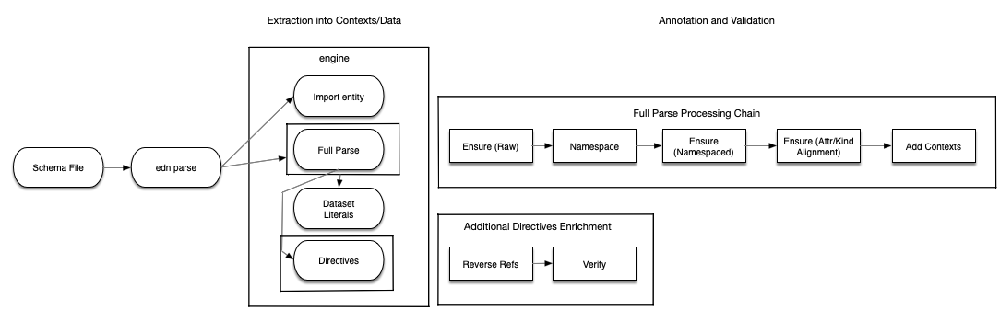
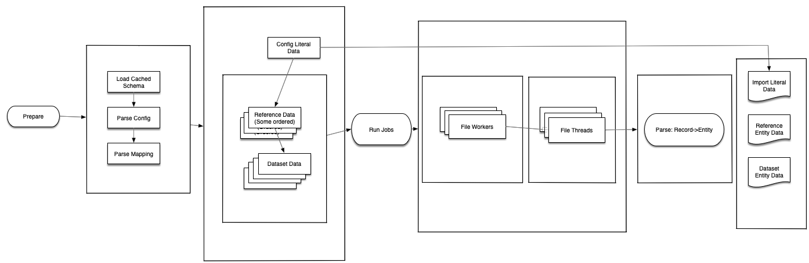
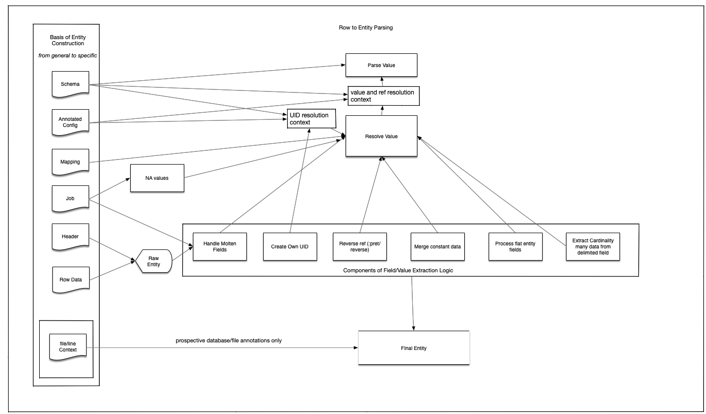

# Pret Import: Prepare

The pret import prepare process uses context from the database schema (and metamodel) and the config and mapping files to convert tabular data into edn representations of entities.

Each component of the prepare process is explained in more detail in the following subsections.

## Schema

The pret database schema is cached locally as part of the pret package. The database schema is loaded into local memory when pret starts and stores redundant information, indexed for access by ident, attribute types, etc. to speed up schema driven inference.

### Schema data

The schema data is the raw schema data, as it exists in Datomic.

```clojure
{:db/ident               :clinical-observation/pfs
 :db/valueType           :db.type/float
 :db/cardinality         :db.cardinality/one
 :db/doc                 "The progression free survival of the subject in months. Unless more information is
                          available, such observations should be connected to the End of Study (EOS) timepoint"}
```

We make use of raw Datomic schema data, such as attribute types, throughout the import (prepare) process. I.e. in coercing literal
values, or determining when to resolve values from tables as references to entities.

An illustration of the schema parsing process is below:



Note the `ensure` steps above. Each of these guarantees that all keys in the config are either
valid `:pret/...` syntax, or exist in the schema. Additional common mistakes, invalid nesting,
etc. are each caught as well and reported to the user.

### Stepped out Schema Parsing

1. Ensure raw schema
2. Namespace the config file
3. Ensure namespaced information
4. Ensure all attributes and entity info

Temporary key additions in final:

- `pret/node-kind`
- `pret/ns-node-txt`


### Metamodel data

The metamodel exists as another layer in the Datomic database to annotate the schema with additional information. That information is
used to infer attribute kinds and context IDs, etc., and to validate the structure of the config file.

An example below, for measurement set:

```clojure
{:kind/name        :measurement-set
 :kind/attr        :measurement-set/name
 :kind/context-id  :measurement-set/name
 :kind/parent      :assay
 :kind/need-uid    :measurement-set/uid}

{:db/id    :assay/measurement-sets
 :ref/from :assay
 :ref/to   :measurement-set}

{:db/id    :measurement-set/measurements
 :ref/from  :measurement-set
 :ref/to    :measurement}
```

shows that we can infer parent entity relationships, the kinds of entities pointed to by reference attributes, etc.
using the information in the metamodel.

### Indexed data

Indexed Schema data is stored in different index types. e.g., `:index/idents` as:

```clojure
#:index{:idents {:measurement/tumor-purity {:db/id 220, :db/ident :measurement/tumor-purity ...
                {:dataset/assays {:db/id 237 ... }}
```

Allows for any attribute, etc. to be looked up by its ident in constant time (instead of e.g. via seq manipulation
or tree lookup).


## Mappings

The mappings file is one of the simpler file/data structures, and mappings are loaded into a hash map that remaps from values specified for particular enums to the schema enum each group of names/aliases corresponds to.

### Mappings File to Reverse Lookup

An example of a specification from the mappings file:

```clojure
{:pret/mappings {:enum/metastasis {true ["Met" "T"]
                                   false ["Primary" "N/A" "F" ""]}}
```

is mapped into a form that facilitates:

```clojure
(get-in mappings [attr val])
```

Example section:

```clojure

{:enum/metastasis {"Met" true
                   "T" true
                   "Primary" false
                   "N/A" false
                   "F" false}}
```

Supports:

```clojure
(get-in mappings [:enum/metastasis "T"])
```

## Config File

When the config file is parsed, three different components are extracted:

1. Information on structure and context for all entity maps in config tree
2. Literal data to be transacted
3. File processing directives defined in the config file (anytime `:pret/file` appears)

Functionality for parsing the config file is in the namespace `org.candelbio.pret.parse.config`

Part of the contextual information that matters is structural. That is, the nesting of entities, such as import -> dataset -> assay -> measurement-set, etc. matters. This context is parsed with the library contextual and then stored through annotations on the config’s in-memory edn representation.

The data that is not stored as literals, but must instead be parsed from files is parsed through `org.candelbio.pret.import.engine.parse.data` using the full schema and import context. Each of these directives defines a job that the engine runs.

The least straight forward portion of the config parsing is as follows: There are two passes through the config file, one prior to namespacing, and one after. The reason for this is that we need to infer the namespaces of keys that occur in the context of the config map from their structure before we can namespace them. To use the example from above:

```
import -> dataset -> assay -> measurement-set
```

Entity types are referred to from their structure (the nesting of their referring names, recursively) from:

```clojure
{:import-name :dataset {:name :assays [{... :measurement-set/}}]}
```

:as

```clojure
[:dataset :assay :measurement-set]
```

To their namespaced, database schema aligned names:

```clojure
[:dataset/assays :assay/measurement-sets :measurement-sets/…]
```

etc.


## Job Execution

Execution of jobs is done in parallel through core.async, as is each line of each file defined by directive. All files are tab separated value files, and the directives contain a specification of how the remapping is to be done from each record (one row, or line, of a file).

One file being processed is run with `job->file`, and a number of these are run at once with parallelism equivalent to the `file-worker-count` pret setting.

Each file is processed asynchronously, (this is done because file IO is not the bottleneck, but rather processing time, e.g. related to reference resolution, is the bottleneck), and a number of threads for processing runs equivalent to the `threads-per-file` setting.




### Expected error behavior

Error handling is done via anomalies. Parts of the code that can throw are wrapped in try/catch and this returns anomalies when encountered. When anomalies show up on channels that otherwise expecting results, the anomalies propagate up, eventually either being logged (when `continue-on-error` is set), or throwing (and aborting prepare) [this is the default behavior].

Anomalies are used to keep from throwing in nested threads in core.async, as this becomes very tricky to troubleshoot and throws confusing stack traces which expose pret internals in front of end users. Anomalies are formated with a convention that is parsed through common error handling logic. One key is provided per appropriate context where an error occurs. For instance, if an error with a data file is a missing var to column mapping, you might see:

```clojure
:data-file/missing-var-column-mapping {:column-name col, :vars [v1, v2, v3] :data-file fname}
```

Pret will format this into a user friendly error before reporting.

### Process Record Processing Flow

Within each file processing job, the meat of the work is done by `engine.parse.data/record->entity` which takes a TSV row and transforms it into an entity map. This requires the parsed and annotated config, the schema (cached in memory), and the mapping file (also following parsing), and information from the “job” (the directive map, which corresponds to the decorated, file job defining map in the config file), the header (as parsed from first line of the TSV file), and the individual record (as naively parsed into Clojure) as well as an import-context, which is used to track the filename and line-number for logging, annotation, or error reporting.

The record processing flow is illustrated below:



_Note_: that this is a post-facto diagram, not a design specification, and any difference in this chart versus the code should prioritize the code as the source of correctness.

On the left are all the different data structures used to construct an entity from a row in a file. On the left are all the components of the record processing workflow. The arrows between the sections show the dependencies each has on data and try to dilineate, when possible, which
dependencies are necessary at a top level, and which are necessary because they are threaded down to common processing logic (most of which is in `resolve-value` and `parse-value`)

The order independent extracted components are:
`molten-data`, `self-uid-data`, `reverse-ref-data`, `constant-data`, `tidy-data`, `card-many-data`. Each of these is merged into an entity. Then, keys used for processing logic, all prefixed with `pret` are removed, and NA handling behavior alters the entity (if defined) in its final form.

_Note_: the use of the name `tidy-` is a historical artifact and does not align with the semantics of tidy data in general R or data science use (tidy in that case meaning that each row contains one observation), and that molten data really just means that var names are stored as entries with one column (this is roughly correspondent with the meaning of molten in the [Hadley Wickham article](https://vita.had.co.nz/papers/tidy-data.pdf ) and tidy data is a flat table (may contain multiple observations). Note that tidy and molten conventions as per the language in function titles may both appear in the same record (and thus both are extracted and merged from the same record at times).

Note that differnet components have different dependencies. The bottom level `parse-value` always falls back to the Schema when opting to coerce scalar values (e.g. `1` as integer or float). Other specific processing component dependencies are reflected in the dependency chart in the Record Processing Flow diagram above.

## Example row and entity comparisons

Below is an example of rows and entities derived from them, given (decorated) config context.

```
cluster.id	value	variable	sample	epitope	sample.ind
cl4	100000.77624513915673	median-channel-value	TCGA-02-2483-01A-01R-1849-01	CD33	1
cl144	NA median-channel-value	TCGA-02-0047-01A-01D-1490-08	CCR2	2
```

is parsed to:

```clojure
{:cell-population/uid "template-dataset/CyTOF/Spitzer clustered/cl1"
 :cell-population/from-clustering true
 :cell-population/name "cl1"
 :measurement-set/_cell-populations [:measurement-set/uid "template-dataset/CyTOF/Spitzer clustered"]}
{:cell-population/uid "template-dataset/CyTOF/Spitzer clustered/cl2"
 :cell-population/from-clustering true
 :cell-population/name "cl2"
 :measurement-set/_cell-populations [:measurement-set/uid "template-dataset/CyTOF/Spitzer clustered"]}
```

Given context:

```clojure
{:name "Spitzer clustered"
 :description "All data pooled together and clustered with grappolo"
 :cell-populations [{:pret/input-file "processed/cell_populations_cluster_Spitzer.txt"
                     :name "cluster.id"
                     :pret/constants {:from-clustering true} }]
 :measurements [{:pret/input-file "processed/cytof_measurements_clusters_Spitzer.txt"
                 :pret/na "NA"
                 :pret/omit-if-na [:measurement/median-channel-value
                                   :measurement/percent-of-leukocytes]
                 :sample "sample"
                 :cell-population "cluster.id"
                 :epitope "epitope"
                 :pret/variable "variable"
                 :pret/value "value"
                 :pret/variables {"median-channel-value" :measurement/median-channel-value
                                  "popsize" :measurement/percent-of-leukocytes}}
```

With additional annotations (from config parsing):

```clojure
:pret/node-kind :measurement,
:pret/ns-node-ctx
[:dataset :dataset/assays 4 :assay/measurement-sets 1 :measurement-set/measurements 0],
:pret/out-file-prefix "00-priority-",
```


## Reference to unique ID (UID) resolution

To resolve references, we must resolve entity names to their Context specific unique identifier (UID). This is done by prepending all portions of context from each parent in the nesting to the (unqualifed) identifier. For instance, if we have an identity like "12" or "A23" we must know
that this is for subject "dataset-20/12" or sample "dataset-20/A23". If sample refers to subject "12" we also have to resolve that (in the context of the import config nesting) as a reference to "dataset-20/12".

The logic of self-uid-data, reverse-ref-data, and other reference resolution is therefore more complex. We make use of the `:pret/ns-node-ctx` (namespaced node context) which knows the list of kinds to construct the appropriate uid if needed. A node context looks like:

```clojure
[:dataset :dataset/subjects 0 :subject/therapies]
```

For each attribute in the path, we must resolve partial UID context segments from each. So in the case above, we need the dataset
identifier, the subject identifier, and the therapy identifier. Attributes used for context ID are specified in the metamodel. While there are a few entries into UID resolution, all currently falls back to `resolve-uid` in the code.

The code iterates through the context stack, prepending relevant portions of the UID when necessary. Any context prefix must be a data literal,
but the resolution of which of these matters for certain entities because, due to where they are nested, an entity may refer to e.g. therapies
in one list of subjects, or therapies in a different list of subjects, etc. (the concrete case most often encountered is with cell populations
and types).

_Note_: the context ID resolution is all driven by the config and its structure, as well as the metamodel from the Datomic schema. Nothing here is hard-coded to the pret schema and if anything is found to be incorrect in the current logic, this invariant (data driven resolution based on
  metamodel) should be preserved.
